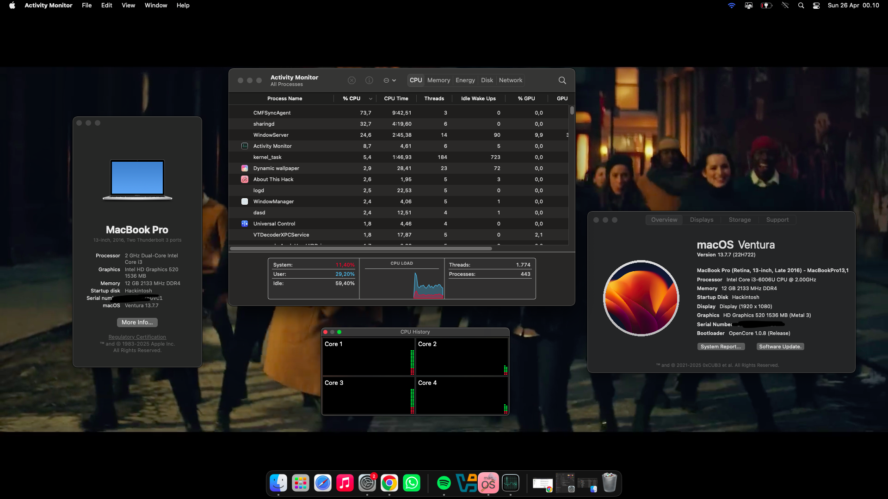
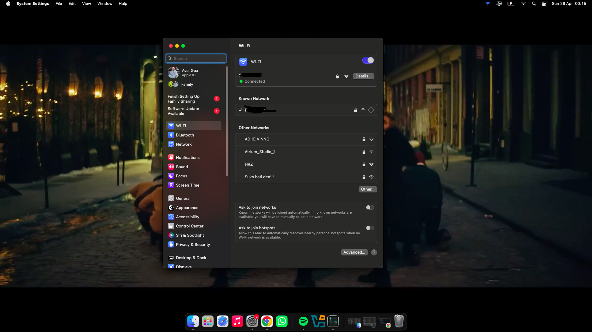

# ASUS Vivobook X441U Hackintosh (OpenCore)

A highly optimized and stable OpenCore EFI for the **ASUS X441UV** series. This configuration has been battle-tested for daily productivity.

## 💻 System Specifications
| Component | Details |
| :--- | :--- |
| **Model** | ASUS Vivobook X441UV |
| **Processor** | Intel® Core™ i3 6006u|
| **Graphics** | Intel® HD Graphics 520 |
| **dGPU** | NVIDIA GeForce (Disabled via SSDT for power efficiency) |
| **Network** | Atheros Qualcomm AR9565 |
| **RAM** | 12GB |
| **Audio** | Realtek ALC255 (Layout-ID: 21) |
| **Bootloader** | OpenCore |
| **Current OS** | Ventura |

---

## ✅ What's Working
- [x] **Graphics Acceleration (QE/CI)** - Full smooth transparency.
- [x] **CPU Power Management** - Optimized for mobile efficiency.
- [x] **Battery Indicator** - Accurate percentage and charging status.
- [x] **WiFi - Native feel with OCLP Patches ( Need to spoof, look guide below )
- [x] **Audio & Microphone** - Internal speakers, headphones, and mic working.
- [x] **Sleep & Wake** - Fixed (No instant wake or black screen).
- [x] **Trackpad & Keyboard** - Multi-touch gestures and brightness/volume keys.
- [x] **USB Ports** - Fully mapped (USB 3.0 & Type-C).

## ❌ What's Not Working
- **NVIDIA dGPU** - macOS does not support Optimus technology. Disabled to save battery and reduce heat.
- **BT** - Need more patches, and honestly just not worth the fix. Just change the whole wifi card for best experience.

# Fixing WI-FI For native feel - Tutorial for Athernos cards
Wi-Fi (Atheros AR9565)
Supported upto High Sierra (Support dropped in Mojave).
 
 
**macOS version <= 10.14 :**
 
Follow this guide [here](https://www.insanelymac.com/forum/topic/328426-qualcomm-atheros-ar9565-wireless-for-os-x-108-1014/)

**macOS version >= 12 :**
 

The wireless card lost support after macOS 10.14. So, spoofing is required to make it appear as a natively supported card(in this case, as Atheros AR928x). In this EFI, spoofing is already done in the `config.plist` file.

</img>
Follow this guide <a href=https://www.insanelymac.com/forum/topic/359007-wifi-atheros-monterey-ventura-sonoma-sequoia-work/>here</a>

## ⚠️ Disclaimer
This project is for educational purposes. I am not responsible for any damage to your hardware. Always back up your data before modifying your EFI partition.

---
